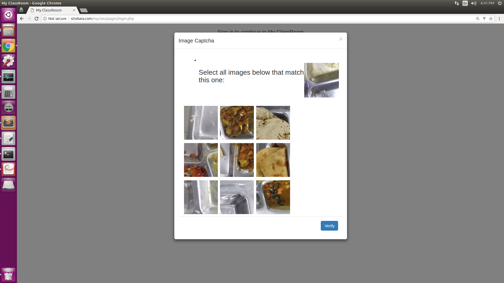

# My-ClassRoom-WebApp

Myclassroom app with reCaptcha supporting features like course creation, group creation, adding assignments, etc and different levels of users like TA, Lecturer, students.

### Demo
 ```bash
  sitekara.com/myclass/
  ``` 

### reCAPTCHA System

The reCAPTCHA system is used to annotate Mess food images by displaying a sample image and letting the users to select similar images for verification.


### Installing

Follow below steps to setup the Myclassroom app in your local system.

* Install xampp in windows or Install lampp in ubuntu
* Download this web app and copy it to htdocs folder in xampp or lampp folder
* Create database as "dev_myclass" in phpmyadmin(with out quotes)
* Create user as "myclass" , password as "myclass" with all permission(with out quotes)
* In phpmyadmin select the dev_myclass database and import dev_myclass.sql from sql_db folder.
* launch the myclass app by 
 ```bash
  http://localhost/myclass
  ``` 
  


